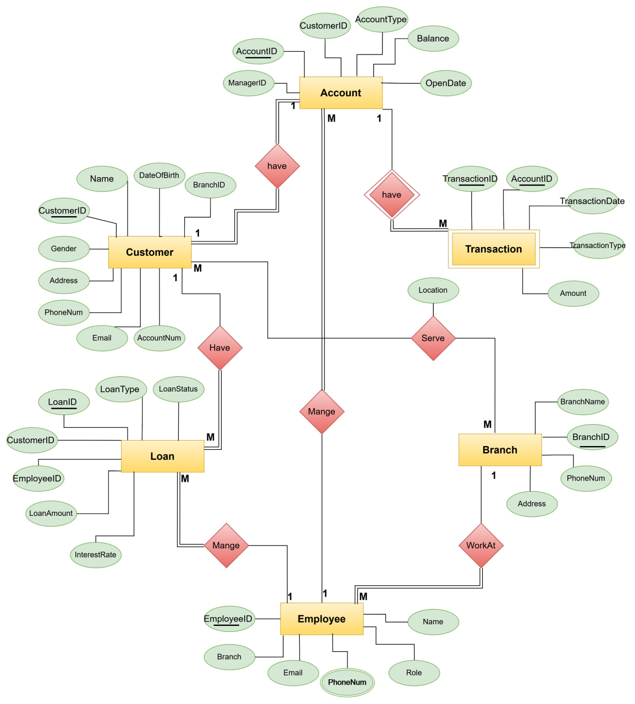

# Bank-Management-System

### Overview

The Bank Management System is a complete project designed to manage the operations of a bank and it includes features for managing customer accounts, transactions, employees, branches, and loans, and the system ensures efficient handling of banking tasks such as deposits and withdrawals

# Database Structure

- Customer: Stores personal information and links to accounts

- Account: Contains details about account types and balances

- Transaction: Records all banking operations

- Employee: Stores information about bank employees

- Branch: Details about bank branches.

- Loan: Tracks loan data and repayment schedules

# ERD

### Entities:

1. Customer
2. Account
3. Transaction
4. Employee
5. Branch
6. Loan

### Relationships:

1. A Customer can have ony one Account
2. An Account can have multiple Transactions
3. An Employee works at a Branch
4. A Customer can take multiple Loans
5. An Employee can manage multiple Accounts and Loans
6. A Customer can deal with multiple Branches through the in selected address

# Database Mapping

# DB Diagram

